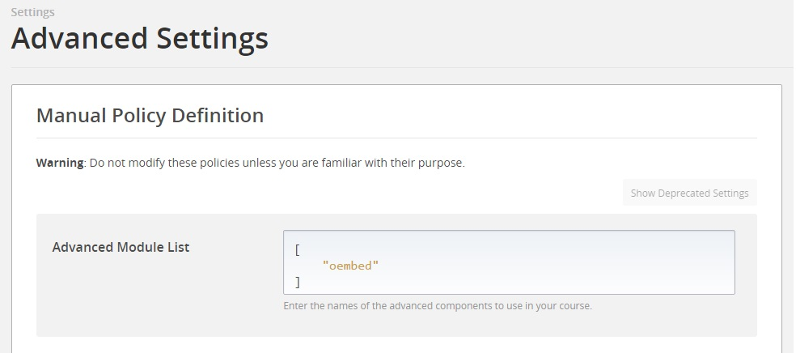
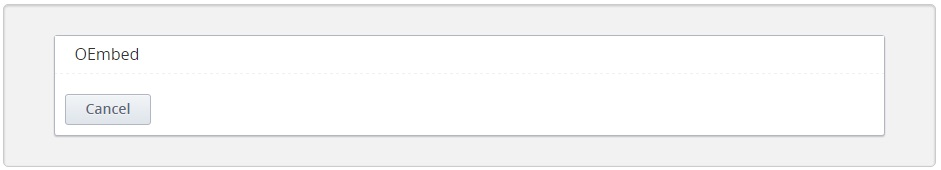
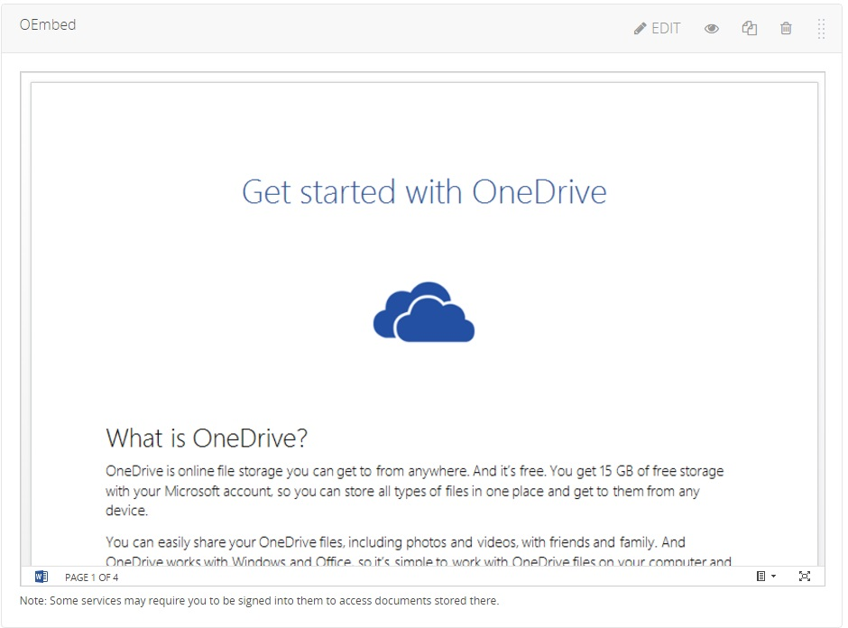
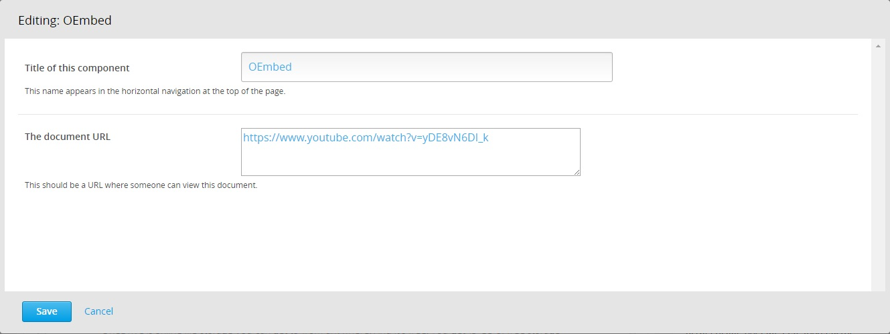
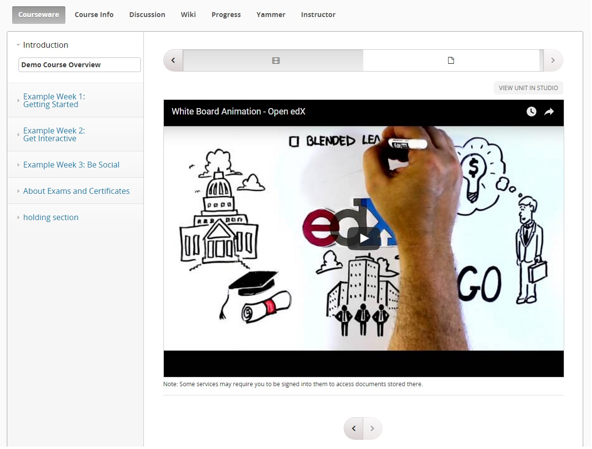

OEmbed XBlock
===================

The “OEmbed XBlock” allows course content authors to add files stored in various internet file storage services to the course. The files can be added as embedded content.

Students can view these files in their Open edX or edX.org courses.

Code of Conduct
---------------
This project has adopted the [Microsoft Open Source Code of Conduct](https://opensource.microsoft.com/codeofconduct/). For more information see the [Code of Conduct FAQ](https://opensource.microsoft.com/codeofconduct/faq/) or contact [opencode@microsoft.com](mailto:opencode@microsoft.com) with any additional questions or comments.


Installation
------------

To install the OEmbed XBlock within your edX Python environment, run the following command:

```bash
$ pip install /path/to/xblock-oembed/
```

Ensure that you have added the following to /edx/app/edxapp/edx-platform/cms/envs/common.py
- ALLOW_ALL_ADVANCED_COMPONENTS: True

Also ensure that you have restarted edX services after these steps.

Enabling in Studio
------------------

To enable the OEmbed XBlock within studio:

1. Navigate to `Settings -> Advanced Settings` from the top nav bar.
2. Add `"oembed"` to the Advanced Module List, as shown in the screen shot below.



Usage
-----
Once enabled in Studio, it's easy to use the OEmbed XBlock.

Start by navigating to the unit in studio where you want to insert your file. From here choose the `Advanced` component.


This will bring up a list of the XBlocks that have been enabled in Studio. If you followed the previous step to enable the OEmbed XBlock in Studio you will see an option titled `OEmbed`. Click on it to insert the OEmbed XBlock into your unit.



After you've inserted the OEmbed XBlock, a default document will be inserted into your unit as shown in the screen shot below.



To change the file added to the course using the OEmbed XBlock, click on the `Edit` button on the upper-right corner of the XBlock. This will bring up the edit dialog where you can change the display name of the component as well as the  document that is being inserted and how you want it to be embedded.



In this dialog, you can

- Update the XBlock title.
- Enter the URL to the file from its original location (in YouTube or OneDrive or Google Drive or Dropbox etc.) 
    - Note that the file must be publicly accessible. You will have to follow the directions provided by the file storage service where the file is stored to make the file public. 
    - Also, note that you do not need to obtain an embed code for the file yourself. The OEmbed XBlock can obtain it automatically for many services commonly used for educational content. On the other hand, if you already have an embed code, you can certainly enter that and the OEmbed XBlock will use it instead of the URL. 

After you click save, your OEmbed XBlock will have been updated with the new values.

At present, the following services have been tested:
- Box.net
- Dropbox
- Google docs
- Google presentations
- Issuu
- Office Mix
- OneDrive for Business
- OneDrive for consumers
- Screenr
- Slideshare
- Soundcloud
- TED
- Vimeo
- YouTube

More services can be added easily. Even if a service is not explicitly supported, an attempt will be made to allow you to include the file, but it may fail depending upon the level of support provided by the service.
Also note that some may need their own login before you can view the files in their original location.


At this point simply click on the `Publish` button and the file will be available for students to view it from the LMS.



Troubleshooting
---------------

In case the XBlock fails to appear in the Advanced menu or other errors, you may check the following:
- Run `sudo -u edxapp /edx/bin/pip.edxapp list`, to verify that "xblock-oembed" is installed
- Verify that "XBLOCK_SELECT_FUNCTION = prefer_xmodules" is present in the following config files:
  - /edx/app/edxapp/edx-platform/lms/envs/common.py
  - /edx/app/edxapp/edx-platform/cms/envs/common.py
- Ensure that you have restarted edX services after installing the XBlock
